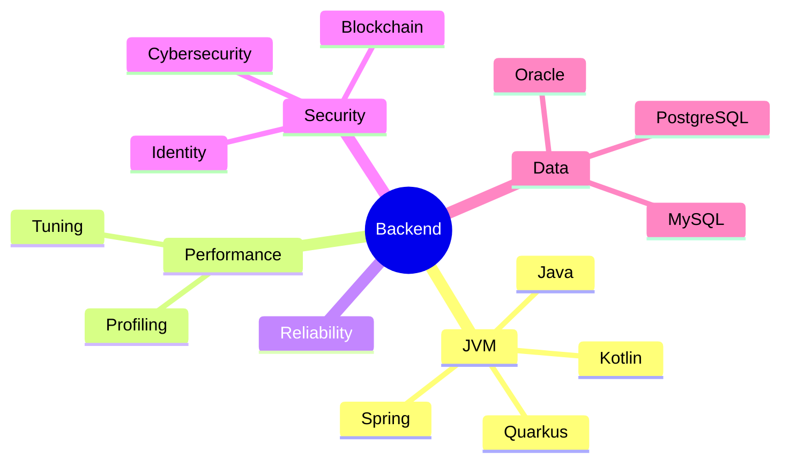



  

  Scalable, secure, high-performance backend systems. ⚡🔒
   
  🧠 JVM-first | 🛡️ Security-minded | 🚀 Performance-tuned

---

<table>
<tr>
<td width="60%" valign="top">
<h3>Snapshot ⚙️</h3>

I design and build JVM-first backend systems for modern web and mobile applications, with scalability, security, and performance as first-class requirements.

<strong>North Star</strong>: Reliability, security, and speed are treated as features, not afterthoughts. 🧭

<h3>Focus Areas 🔍</h3>
<ul>
  <li>🧠 JVM-first backend engineering in Java and Kotlin.</li>
  <li>🚦 Scalable system design, profiling, and performance tuning.</li>
  <li>🔐 Applied security research spanning blockchain and identity management.</li>
  <li>🎤 Publications and conference talks on cybersecurity.</li>
  <li>👨‍🏫 Former academic tutor in Java, C, and Python at Hellenic Mediterranean University.</li>
</ul>

<h3>Toolbox 🧰</h3>

<strong>Languages 💻</strong>

  
  
  
  
  

<strong>Frameworks 🧩</strong>

  
  
  

<strong>Databases 🗄️</strong>

  
  
  

</td>
<td width="40%" valign="top">
<h3>Metrics 📊</h3>

  
  
  

</td>
</tr>
</table>

### Focus Map 🗺️

### Activity 🔥

  

### Connect 🤝

