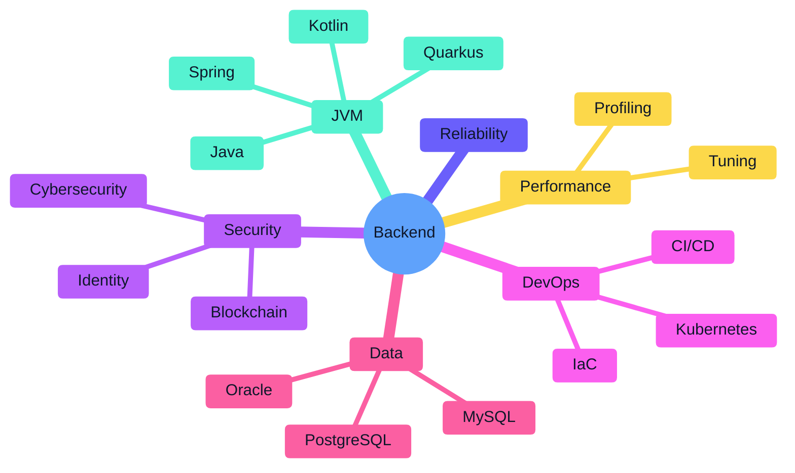
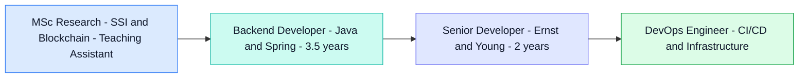

<div align="center">
  
</div>

<div align="center">
  Scalable, secure, high-performance backend systems. ⚡🔒<br/>
  🧠 JVM-first | 🛡️ Security-minded | 🚀 Performance-tuned
</div><br>

<div align="center">
  <a href="https://npapatheodorou.dev/"></a>
  <a href="https://www.linkedin.com/in/npapatheodorou"></a>
  <a href="mailto:n.papatheodorou@pm.me"></a>
  <a href="https://twitter.com/n_papatheodorou"></a>
</div>

<div align="center">
  
</div>

<p align="center">
  <i>✨ Building resilient platforms where security and speed coexist.</i>
</p>

---

## ✨ Snapshot

<table>
<tr>
<td width="60%" valign="top">

### 👤 Profile
I design and build JVM-first backend systems for modern web and mobile applications, treating scalability, security, and performance as first-class requirements.

**North Star 🧭**: reliability, security, and speed are features, not afterthoughts.

### 🎯 Focus Areas
- 🧠 JVM-first backend engineering in Java and Kotlin
- ⚙️ CI/CD pipeline architecture and delivery automation
- 📦 Containerized systems and infrastructure as code
- 🔐 Secure system design, blockchain, and identity research
- 👨‍🏫 Mentoring and technical knowledge-sharing

### 🧭 Career Snapshot
- ⚙️ DevOps Engineer (current)
- 🏢 Senior Developer at Ernst and Young (EY)
- 💻 Backend Developer (3.5 years)
- 🎓 MSc Researcher and Teaching Assistant

### 🧰 Toolbox
**💻 Languages**
<br/>
<a href="https://www.java.com/"></a>
<a href="https://kotlinlang.org/"></a>
<a href="https://www.python.org/"></a>
<a href="https://www.javascript.com/"></a>
<a href="https://www.cprogramming.com/"></a>

**🧩 Frameworks**
<br/>
<a href="https://spring.io/"></a>
<a href="https://spring.io/projects/spring-boot"></a>
<a href="https://quarkus.io/"></a>
<a href="https://www.zkoss.org/"></a>

**⚙️ DevOps and Infra**
<br/>


**📊 Data and Observability**
<br/>
<a href="https://www.oracle.com/database/"></a>
<a href="https://www.postgresql.org/"></a>
<a href="https://www.mysql.com/"></a>


</td>
<td width="40%" valign="top">

### 📈 Metrics
<p align="center">
  
</p>

</td>
</tr>
</table>

## 🏆 Engineering Impact

| Metric | Achievement |
|---|---|
| 🚀 Deploy time reduction | 95% faster |
| ⬆️ System uptime | 99.95% achieved |
| 📦 Systems built | 25+ production systems |
| 🔒 Security incidents | Zero critical vulnerabilities |
| ⚡ Performance improvement | 94% response-time reduction |
| 🏗️ Provisioning automation | 97% faster infrastructure setup |

## 🗺️ Focus Map


```mermaid
%%{init: {'theme':'base','themeVariables':{'primaryColor':'#DBEAFE','primaryTextColor':'#0F172A','primaryBorderColor':'#3B82F6','secondaryColor':'#CCFBF1','secondaryTextColor':'#0F172A','secondaryBorderColor':'#14B8A6','tertiaryColor':'#FEF3C7','tertiaryTextColor':'#0F172A','tertiaryBorderColor':'#F59E0B','lineColor':'#475569','textColor':'#0F172A'}}}%%
mindmap
  root((Backend))
    JVM
      Java
      Kotlin
      Spring
      Quarkus
    Performance
      Profiling
      Tuning
    Reliability
    Security
      Blockchain
      Identity
      Cybersecurity
    DevOps
      CI/CD
      IaC
      Kubernetes
    Data
      Oracle
      PostgreSQL
      MySQL
```

## 🚀 Career Journey


```mermaid
graph LR
    A[MSc Research - SSI and Blockchain - Teaching Assistant] --> B[Backend Developer - Java and Spring - 3.5 years]
    B --> C[Senior Developer - Ernst and Young - 2 years]
    C --> D[DevOps Engineer - CI/CD and Infrastructure]

    style A fill:#DBEAFE,stroke:#3B82F6,color:#0F172A
    style B fill:#CCFBF1,stroke:#14B8A6,color:#0F172A
    style C fill:#E0E7FF,stroke:#6366F1,color:#0F172A
    style D fill:#DCFCE7,stroke:#16A34A,color:#0F172A
```

## 🎓 Research and Teaching

<table>
  <tr>
    <td width="50%" valign="top">
      <h3>🔬 MSc Thesis</h3>
      <p><strong>Blockchain-based Self-Sovereign Identity (SSI)</strong></p>
      <ul>
        <li>Decentralized identity management</li>
        <li>Verifiable credentials implementation</li>
        <li>Privacy-preserving architecture</li>
        <li>Enterprise adoption recommendations</li>
      </ul>
    </td>
    <td width="50%" valign="top">
      <h3>👨‍🏫 Teaching Experience</h3>
      <ul>
        <li>Java: OOP and design patterns</li>
        <li>C: systems programming</li>
        <li>Python: scripting and algorithms</li>
        <li>Linaro Connect: workshop leader</li>
        <li>Mentorship: junior developers</li>
      </ul>
    </td>
  </tr>
</table>

## 🔐 Core Principles

```text
🔒 Security-first        -> every system is designed with security at its core
⚙️ Automation-driven     -> if it can be automated, it should be
⚡ Performance-focused   -> measurable improvements over assumptions
🏗️ Scalable design       -> architecture built for growth from day one
📈 Observable systems    -> instrumentation is mandatory, not optional
🔄 Continuous improvement -> iterative engineering culture
```

## 🔥 Activity

<div align="center">
  <picture>
    
  </picture>
</div>

## 🤝 Connect

<div align="center">
  <a href="mailto:n.papatheodorou@pm.me"></a>
  <a href="https://www.linkedin.com/in/npapatheodorou"></a>
  <a href="https://twitter.com/n_papatheodorou"></a>
</div>

<div align="center">
  
</div>
